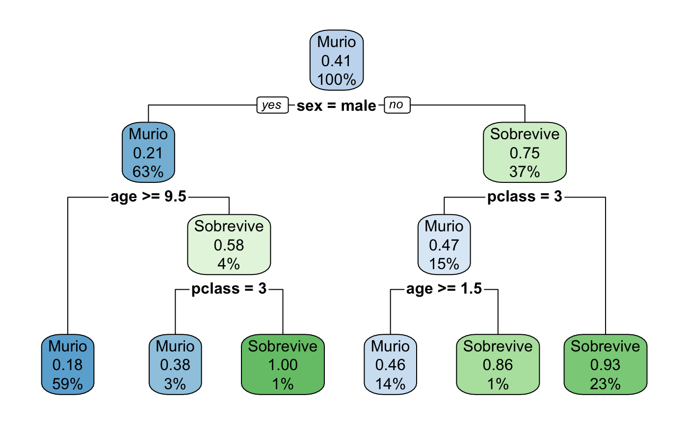

# Titanic Data Analysis

This repository contains an analysis of the Titanic dataset, providing insights into the survival rates of passengers based on various demographic factors. The analysis is authored by Raul Cantu (A01087683), with the document generated on February 14, 2023. The output is an HTML document that includes a table of contents, floating navigation, and the option to download the code.

## Importing the Database

The dataset is imported from a CSV file, allowing for the examination of passenger data from the Titanic. This step is crucial for loading the data into the R environment for further analysis.

## Understanding the Database

We begin our analysis by summarizing and structuring the Titanic dataset to understand its composition better. This includes viewing the summary statistics and the structure of the dataset to identify the types of data and the information available for analysis.

## Filtering the Database

To focus our analysis on factors that could influence survival rates, we filter the dataset to include only relevant variables such as passenger class, age, sex, and survival status. The survival status is converted into a factor to facilitate analysis, distinguishing between those who survived and those who did not. Missing values are identified and handled appropriately to ensure the integrity of the analysis.

## Creating a Decision Tree

A decision tree is constructed to model the probability of survival based on the filtered dataset. This machine learning technique allows us to visualize and quantify the impact of different factors on survival outcomes. The decision tree is plotted to provide a clear and interpretable model of survival probabilities.

## Conclusions

The analysis concludes with significant findings on survival probabilities within the Titanic dataset:

- The highest probabilities of survival are observed in young boys under 9.5 years of age from the first and second classes (100%), and women from the first and second classes (93%).
- The lowest probabilities of survival are found in men over 9.5 years of age (18%) and boys under 9.5 years of age in the third class (38%).

This study provides valuable insights into the dynamics of survival on the Titanic, highlighting the influence of age, sex, and passenger class on the likelihood of surviving the disaster.
